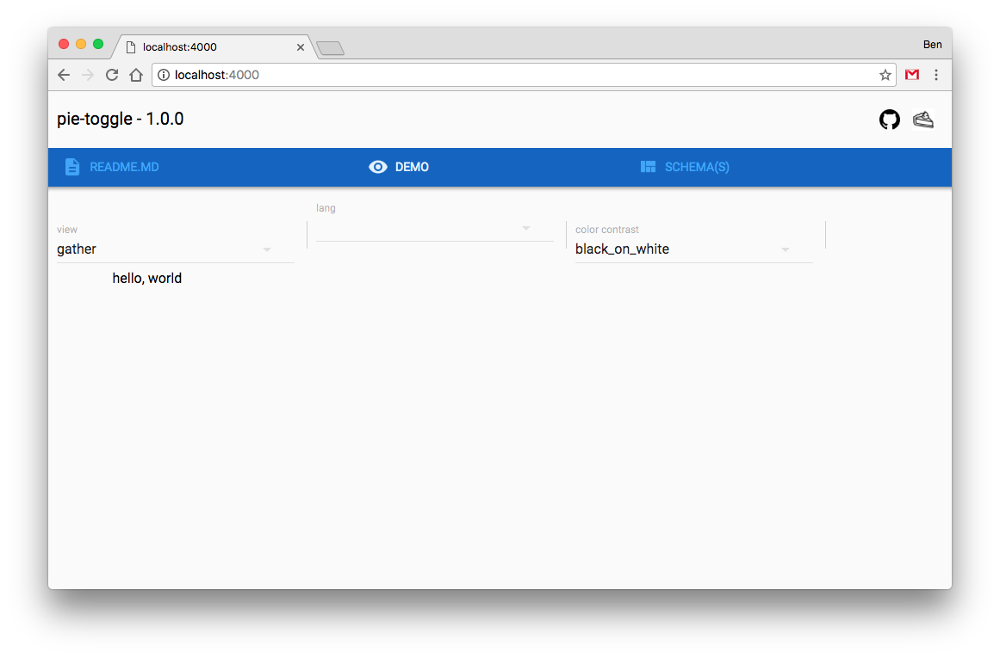

## Setting up your first PIE

To start creating a custom PIE, the first step is to create a directory and initialize the project. For the purposes of this explanation, we'll be developing a simple toggle with a value of either `true` or `false`.

    mkdir pie-toggle
    cd pie-toggle
    npm init

Using the interactive `npm` command, set the name of the interaction to `pie-toggle`, and set the "entry point" to `src/index.js`. Afterwards, there should be a `package.json` file in the directory which looks like this:

    {
      "name": "pie-toggle",
      "version": "1.0.0",
      "description": "",
      "main": "src/index.js",
      "scripts": {
        "test": "echo \"Error: no test specified\" && exit 1"
      },
      "author": "",
      "license": "ISC"
    }

It would also be useful to set up a README at this point:

    touch README.md

### Creating a Web Component

To get started, we'll need to create a definition for our PIE web component in a `src` directory:

    mkdir src
    cd src
    touch index.js

Fill out this file with the following code:

    export default class Toggle extends HTMLElement {
      
      constructor() {
        super();
        this.innerHTML = [
          '
',
            "hello, world",
          '
'
        ].join('\n');
      }

    }

This defines a simple web component with the content 'hello, world'.

### Setting up demo code

Now that we've got some markup in our custom PIE, we'll need to define an interaction so that we can see it in action. For a custom PIE, this is performed by adding data and markup to the demo. You'll want to create a `docs/demo` directory, and add to it a `config.json` file as well as an `index.html` file:

    mkdir -p docs/demo
    cd docs/demo
    touch index.html
    touch config.json

At this point, your project structure should look like this:

    .
    ├── docs
    │   └── demo
    │       ├── config.json
    │       └── index.html
    ├── package.json
    └── src
        └── index.js

In the `config.json` file, we'll need to define the configuration data to set up the PIE:

    {
      "elements": {
        "pie-toggle": "../.."
      },
      "models": [
        {
          "id": "1",
          "element": "pie-toggle"
        }
      ]
    }

The `elements` field tells `pie` where to find the source for a given element using its name. The `models` property defines the content of the various PIE instances to be rendered. At the moment, we're just setting a PIE referenced by `id=1` to be defined as a `pie-toggle`.

Once the PIE is configured in the JSON, we'll need to define the markup for rendering it in the `index.html` file:

    

    

      <pie-toggle pie-id="1"></pie-toggle>
    

Once this is done, we have the base setup for our custom PIE.

### Running the demo

In order to display our configured PIE in a browser, run the `info` task:

    pie info

Then navigate your browser to `http://localhost:4000` and click the "demo" link. You should see the "hello, world" message we entered earlier:

### Adding data to the model

First off, we will introduce logic so that our custom PIE manages state and provides access to its `model` and `session` properties:

    export default class Toggle extends HTMLElement {
      
      constructor() {
        super();
        this._model = null;
        this._session = null;
        this._rerender();
      }

      set model(m) {
        this._model = m;
        this._rerender();
      }

      set session(s) {
        this._session = s;
        this._rerender();
      }

      get session() {
        return this._session;
      }

      _message() {
        return this._model ? this._model.message : 'hello, world';
      }

      _rerender() {
        this.innerHTML = [
          '
',
            this._message(),
          '
'
        ].join('\n');
      }

      connectedCallback() {
        this.dispatchEvent(new CustomEvent('pie.register', { bubbles: true }));
        this._rerender();
      }

    }

There's also a bit of glue code in here so that our component registers itself with the rest of the PIE framework. As you can see, if there is a `message` property defined in the model it will be rendered into the markup. We'll also need to change the `docs/demo/config.json` file to include a custom message:

    {
      "elements": {
        "pie-toggle": "../.."
      },
      "models": [
        {
          "id": "1",
          "element": "pie-toggle",
          "message": "hello, PIE"
        }
      ]
    }

At this point we will also need a controller for our PIE. Create a `controller` directory in the project root and initialize it using `npm` with the name `pie-toggle-controller` and the entry point `src/index.js`:

    mkdir controller
    cd controller 
    npm init
    mkdir src
    cd src
    touch index.js

Paste the following into the `controller/src/index.js` file:

    export function outcome(question, session) {

      return new Promise((resolve) => {
        resolve({});
      });

    }

    export function model(question, session, env) {

      return new Promise((resolve) => {
        resolve(question);
      });

    }

Now refresh `http://localhost:4000`, click the "demo" tab, and you will see that the message has now been replaced with "hello, PIE".